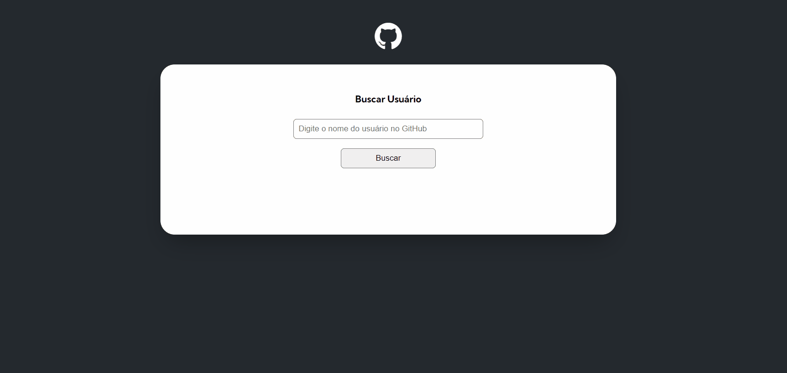

# PROJETO GITHUB API 

Desafio feito para o curso de front-end DevQuest, modulo de JavaScript Avançado.

## PROPOSTA DO DESAFIO 🚀

- A proposta deste desafio era consumir a API do github
- Conjuntamente reforçar as funções com async e await 
- Poder manipular arrays e objetos na prática
 
 

## PROJETO FINALIZADO ABAIXO  

 
 

## TECNOLOGIAS UTILIZADAS 

 
 

## APRENDIZADOS 

Com este projeto pude ter a oportunidade de fazer um projeto de consumir uma API real totalmente do 0, e me saí muito bem estou satisfeito com o resultado, agora praticar mais e mais 

## LINK HOSPEDADO NO GITHUB PAGES 
